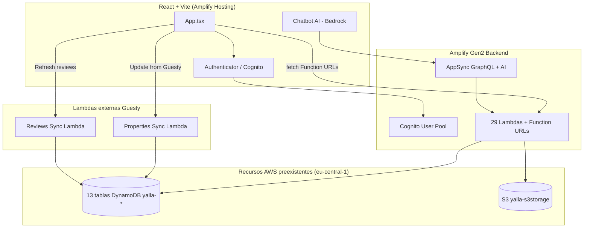

# Configuración AWS Agent Toolkit — yalla3

Documentación del proceso de instalación y validación del [AWS Agent Toolkit for AWS](https://github.com/aws/agent-toolkit-for-aws) para habilitar revisión y optimización de la infraestructura AWS de yalla3 desde Cursor.

**Fecha:** 13 de agosto de 2026  
**Región de trabajo:** `eu-central-1`  
**Región del Agent Toolkit (servicio):** `us-east-1` (obligatoria)

---

## 1. Arquitectura actual validada

### Resumen

Yalla3 es una aplicación **React + Vite** desplegada en **AWS Amplify Hosting (Gen2)** con backend TypeScript (`defineBackend`). La arquitectura es **híbrida**: Amplify gestiona compute y auth; DynamoDB/S3 son recursos preexistentes importados vía CDK.



### Componentes clave

| Componente | Detalle |
|------------|---------|
| **Amplify App ID** | `dd8kh4wy2zlme` |
| **Repositorio GitHub** | `penaloza-pablo/yalla3` |
| **Región AWS** | `eu-central-1` |
| **Cuenta AWS** | `471112597523` |
| **CI/CD** | `amplify.yml` → `npx ampx pipeline-deploy` (sin GitHub Actions) |
| **Auth** | Cognito User Pool (login por email) |
| **Data layer** | 13 tablas DynamoDB + 1 bucket S3 importados en `amplify/backend.ts` |
| **API pattern** | Lambda Function URLs (`authType: NONE`) + fetch desde frontend |
| **GraphQL/AI** | AppSync con chatbot Bedrock (Claude 3 Haiku) para inventario/alertas |
| **Guesty** | Sync externo vía 2 Lambdas fuera del repo; datos en `yalla-properties`, `yalla-bookings`, `yalla-reviews` |

### Tablas DynamoDB

| Tabla | Dominio |
|-------|---------|
| `yalla-inventory` | Inventario |
| `yalla-alarms` | Alertas |
| `yalla-purchases` | Compras |
| `yalla-substractions` | Restas de inventario |
| `yalla-properties` | Propiedades (Guesty) |
| `yalla-bookings` | Reservas |
| `yalla-reviews` | Reseñas |
| `yalla-reviewsync-state` | Estado sync reseñas |
| `yalla-visits` | Visitas |
| `yalla-tasks` | Tareas |
| `yalla-teams` | Equipos |
| `yalla-users` | Usuarios |
| `yalla-visit_types` | Tipos de visita |
| `yalla-visit-templates` | Plantillas de visita |

### Lambdas (29 con Function URL)

Todas en Node.js 22. Handlers en `amplify/functions/`. Permisos IAM granulares definidos en `amplify/backend.ts`.

### Hallazgos de arquitectura (para optimización futura)

1. **Function URLs públicas** — Todas usan `FunctionUrlAuthType.NONE`. Cognito protege la UI, pero los endpoints REST son accesibles si se conocen las URLs.
2. **Guesty fuera del stack** — Lambdas de sync hardcodeadas en `App.tsx`; no gestionadas por Amplify/CDK.
3. **Tablas legacy** — DynamoDB no está definido en Amplify; solo referenciado. Cambios de esquema requieren intervención manual o CDK separado.
4. **Patrón Lambda-as-API** — La mayoría de features no usan GraphQL; usan fetch directo a Function URLs.
5. **Sin GitHub Actions** — Todo el pipeline es Amplify Hosting.

---

## 2. Proceso de configuración del Agent Toolkit

Instrucciones seguidas: [setup.md](https://github.com/aws/agent-toolkit-for-aws/blob/main/setup-instructions/setup.md)

### Paso 1: Detección del sistema operativo

| Parámetro | Valor |
|-----------|-------|
| OS | macOS (Darwin 25.5.0) |
| Shell | zsh |
| Arquitectura | arm64 |

**Resultado:** ✅ macOS detectado

### Paso 2: Instalación/actualización AWS CLI

| Antes | Después |
|-------|---------|
| `aws-cli/2.31.36` (Homebrew) | `aws-cli/2.36.22` (instalador oficial) |
| Sin soporte `agent-toolkit` | Con soporte completo `agent-toolkit` |

**Comando ejecutado:**

```bash
curl -fsSL 'https://awscli.amazonaws.com/v2/install.sh' | bash
export PATH="$HOME/.local/bin:$PATH"
```

**PATH persistido en** `~/.zshrc`:

```bash
export PATH="$HOME/.local/bin:$PATH"
```

**Resultado:** ✅ AWS CLI 2.36.22 instalado en `~/.local/share/aws-cli`

### Paso 3: Autenticación AWS

La región por defecto ya estaba configurada como `eu-central-1`.

Las credenciales SSO ya estaban activas (no fue necesario ejecutar `aws login`):

```json
{
  "UserId": "AROAW3MD7YAJTD2237PVU:amplify-admin",
  "Account": "471112597523",
  "Arn": "arn:aws:sts::471112597523:assumed-role/AWSReservedSSO_amplify-policy_64ce049a40b7c810/amplify-admin"
}
```

> **Nota:** Las credenciales vía `aws login` son válidas 12 horas y pueden renovarse hasta 90 días sin re-autenticarse en el navegador. Si expiran, ejecutar:
>
> ```bash
> aws configure set region eu-central-1
> aws login --region eu-central-1
> ```

**Resultado:** ✅ Credenciales verificadas

### Paso 4: Verificación de acceso

```bash
aws sts get-caller-identity
```

**Resultado:** ✅ AccountId, Arn y UserId devueltos correctamente

### Paso 5: Configuración del Agent Toolkit

```bash
aws configure agent-toolkit --yes --region us-east-1
```

**Agente detectado:** Cursor (`~/.cursor/skills`)

**18 skills AWS instalados por defecto:**

- amazon-bedrock, aws-auth, aws-billing-and-cost-management, aws-blocks
- aws-cdk, aws-cloudformation, aws-compute, aws-containers
- aws-deployment, aws-messaging-and-streaming, aws-observability
- aws-sdk-js-v3-usage, aws-sdk-python-usage, aws-sdk-swift-usage
- aws-security, aws-serverless, launch-with-aws, signing-in-to-aws

**3 skills adicionales instalados para yalla3:**

```bash
aws agent-toolkit add-skill --skill-name aws-amplify --region us-east-1 --agent cursor
aws agent-toolkit add-skill --skill-name amazon-dynamodb --region us-east-1 --agent cursor
aws agent-toolkit add-skill --skill-name connecting-lambda-to-dynamodb --region us-east-1 --agent cursor
```

**Resultado:** ✅ 21 skills instalados en `~/.cursor/skills`

### Paso 6: Verificación del Agent Toolkit

```bash
aws agent-toolkit list-available-skills --region us-east-1
```

**Resultado:** ✅ Catálogo remoto accesible (skills con name, description, skillVersion, categories)

### Paso 7: Reglas AWS para Cursor

Archivo creado: `.cursor/rules/aws-agent-rules.mdc`

Contenido basado en [aws-agent-rules.md](https://github.com/aws/agent-toolkit-for-aws/blob/main/rules/aws-agent-rules.md) + contexto específico de yalla3.

**Resultado:** ✅ Reglas de proyecto configuradas

### Paso adicional: Dependencia uvx para AWS MCP Server

El Agent Toolkit configura el MCP server en `~/.cursor/mcp.json`:

```json
{
  "mcpServers": {
    "aws-mcp": {
      "command": "uvx",
      "args": [
        "mcp-proxy-for-aws@latest",
        "https://aws-mcp.us-east-1.api.aws/mcp",
        "--metadata",
        "INSTALL_SOURCE=aws-cli"
      ]
    }
  }
}
```

`uvx` no estaba instalado. Se instaló **uv 0.12.3**:

```bash
curl -LsSf https://astral.sh/uv/install.sh | sh
```

**Resultado:** ✅ `uv` y `uvx` disponibles en `~/.local/bin`

---

## 3. Archivos y rutas resultantes

| Ruta | Propósito |
|------|-----------|
| `~/.local/bin/aws` | AWS CLI 2.36.22 con agent-toolkit |
| `~/.local/bin/uvx` | Ejecutor MCP proxy |
| `~/.cursor/mcp.json` | Configuración AWS MCP Server |
| `~/.cursor/skills/` | 21 skills AWS instalados |
| `.cursor/rules/aws-agent-rules.mdc` | Reglas AWS del proyecto |
| `AWS-AGENT-TOOLKIT-SETUP.md` | Este documento |

---

## 4. Comandos útiles post-instalación

```bash
# Listar skills instalados
aws agent-toolkit list-installed-skills --region us-east-1

# Buscar skills adicionales
aws agent-toolkit search-skills --search-query "amplify dynamodb" --region us-east-1

# Instalar un skill
aws agent-toolkit add-skill --skill-name <nombre> --region us-east-1 --agent cursor

# Renovar credenciales si expiran
aws login --region eu-central-1

# Verificar identidad
aws sts get-caller-identity
```

---

## 5. Próximos pasos — Revisión y optimización

Con el Agent Toolkit configurado, la revisión profunda puede abordar:

### Seguridad
- [ ] Migrar Function URLs de `NONE` a autenticación IAM o API Gateway + Cognito authorizer
- [ ] Auditar permisos IAM de cada Lambda (principio de mínimo privilegio)
- [ ] Revisar políticas Cognito y reglas de autorización AppSync

### DynamoDB
- [ ] Auditar patrones de acceso vs GSIs existentes
- [ ] Evaluar costos de Scan vs Query en handlers de inventario/propiedades
- [ ] Revisar capacidad (on-demand vs provisioned) y uso de TTL

### Lambda
- [ ] Analizar cold starts, memoria y timeout de las 29 funciones
- [ ] Consolidar handlers similares si aplica
- [ ] Evaluar Lambda Powertools para observabilidad

### Amplify / CI/CD
- [ ] Revisar tiempos de build en Amplify Hosting (8GiB/4vCPU actuales)
- [ ] Evaluar GitHub Actions complementario para lint/test pre-deploy
- [ ] Revisar estrategia sandbox vs producción

### Guesty
- [ ] Incorporar Lambdas de sync al stack CDK/Amplify
- [ ] Externalizar URLs hardcodeadas a SSM/outputs
- [ ] Documentar flujo bidireccional de tareas Guesty

### Observabilidad y costos
- [ ] Configurar dashboards CloudWatch para Lambdas críticas
- [ ] Revisar costos con skill `aws-billing-and-cost-management`
- [ ] Evaluar X-Ray tracing en handlers de alto tráfico

### AI / Bedrock
- [ ] Revisar uso y costos del chatbot Claude 3 Haiku
- [ ] Evaluar prompt caching y límites de tokens

---

## 6. Cómo continuar

1. **Inicia una nueva sesión de Cursor** para que cargue el MCP server y las skills.
2. Verifica en Cursor Settings → MCP que `aws-mcp` aparece como conectado.
3. En la nueva sesión, pide la revisión profunda por área (seguridad, DynamoDB, Lambda, costos, etc.).

> Las credenciales AWS expiran cada 12 horas. Si el MCP server falla con `ExpiredToken`, ejecuta `aws login --region eu-central-1` y reinicia la sesión.
